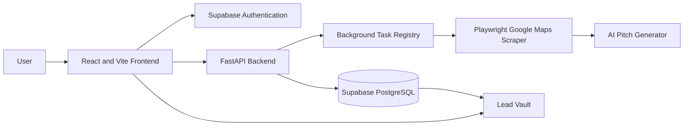

# Clarion

**A lead-intelligence and outreach workspace for freelancers, agencies, and growth teams.**

Clarion searches Google Maps for qualified businesses, evaluates their online presence, optionally generates personalized outreach pitches, and stores acquired leads inside a private Supabase-powered Lead Vault.

[Live Application](https://clarionlabs.vercel.app)

---

## Overview

Clarion converts local-business prospecting into a guided workflow:

1. Select a location and business category.
2. Configure review and website requirements.
3. Run a Playwright-powered Google Maps search.
4. Optionally generate Roman Urdu and English outreach pitches.
5. Save qualified businesses to the user’s Lead Vault.
6. Review, edit, export, delete, or contact prospects.
7. Manage user roles and credit balances through the Admin Command Center.

---

## Features

### Lead Generation

- Google Maps business discovery
- Category and location targeting
- Minimum review filtering
- Missing-website prospecting
- Website-redesign prospecting
- Optional AI-generated outreach
- Background search progress tracking
- Search radius and map-based location selection

### Lead Vault

- Private saved leads for every user
- Business, city, and category search
- Lead filtering
- Pitch review and editing
- WhatsApp outreach actions
- CSV export
- Single lead deletion
- Bulk lead deletion

### Dashboard

- Standard search credit gauge
- AI pitch credit gauge
- 72-hour refill tracker
- Recent saved leads
- Plan-aware account information
- Upgrade card for Free users

### Administration

- Protected Admin Command Center
- User directory
- Role management
- Standard credit management
- AI credit management
- Account deletion controls
- Admin self-deletion protection

### Product Experience

- Premium dark SaaS interface
- Responsive desktop layout
- Mobile navigation
- Lazy-loaded application screens
- Accessible focus states
- Lucide icon system
- Smooth interface transitions

---

## Technology Stack

| Layer | Technology |
| --- | --- |
| Frontend | React, Vite, Supabase JS, Lucide |
| Backend | FastAPI, Uvicorn, Python |
| Browser Automation | Playwright |
| Database | Supabase PostgreSQL |
| Authentication | Supabase Auth |
| AI Outreach | OpenAI-compatible inference API |
| Frontend Hosting | Vercel |
| Backend Hosting | Hugging Face Docker Space |
| Validation | Python `unittest`, ESLint, Vite |

---

## Architecture



### Lead Generation Flow

```text
Search Request
    ↓
FastAPI Validation and Credit Check
    ↓
Background Playwright Task
    ↓
Google Maps Extraction
    ↓
Business Qualification
    ↓
Optional AI Outreach Generation
    ↓
Supabase Persistence
    ↓
Vault Refresh and Credit Update
```

---

## Repository Structure

```text
OpenClaw/
├── openclaw-ui/                 # Active React frontend
│   ├── public/
│   └── src/
│       ├── components/
│       │   ├── admin/
│       │   ├── auth/
│       │   ├── dashboard/
│       │   ├── generator/
│       │   ├── layout/
│       │   ├── settings/
│       │   └── vault/
│       ├── lib/
│       ├── App.jsx
│       ├── index.css
│       ├── main.jsx
│       └── supabaseClient.js
│
├── hf-space/                    # Active FastAPI backend
│   ├── app/
│   ├── api.py
│   ├── database.py
│   ├── scraper.py
│   ├── validators.py
│   ├── ai_engine.py
│   ├── auditor.py
│   ├── Dockerfile
│   ├── requirements.txt
│   └── README.md
│
├── backend_api/                 # Legacy/local reference backend
│
└── README.md
```

> [!IMPORTANT]
> `hf-space/` is the production backend used by the live application.
>
> Do not implement production backend changes inside `backend_api/`.

---

## Prerequisites

Install the following before running Clarion locally:

- Git
- Node.js 20 or newer
- npm
- Python 3.12
- A Supabase project
- Playwright Chromium
- Required API credentials

---

Start the backend:

```bash
uvicorn api:app --host 0.0.0.0 --port 8000 --reload
```

Useful local endpoints:

```text
http://localhost:8000/
http://localhost:8000/health/live
http://localhost:8000/health/ready
```

---

## Validation

### Backend Validation

Run commands that match the files currently present in `hf-space`:

```bash
cd hf-space

python -m compileall \
  app \
  api.py \
  database.py \
  scraper.py \
  validators.py \
  ai_engine.py \
  auditor.py

python -m unittest discover -s tests -v
```

### Frontend Validation

```bash
cd openclaw-ui
npm run lint
npm run build
```

---

## API Routes

The frontend depends on the following backend contracts:

| Method | Route | Purpose |
| --- | --- | --- |
| `POST` | `/api/generate` | Start a lead-generation task |
| `GET` | `/api/status/{task_id}` | Poll task progress |
| `GET` | `/api/history` | Load the user’s Lead Vault |
| `POST` | `/api/leads/bulk-delete` | Delete saved leads |
| `POST` | `/api/leads/update-pitch` | Save an edited pitch |
| `GET` | `/api/user/profile` | Load profile and credits |
| `POST` | `/api/user/settings` | Save user settings |
| `GET` | `/api/admin/users` | Load users for an administrator |
| `POST` | `/api/admin/users/update` | Update a role and credit balance |
| `POST` | `/api/admin/users/delete` | Delete a user account |

Health routes may include:

```text
GET /
GET /health/live
GET /health/ready
GET /api/health
```

---

## Supabase Data Model

Clarion primarily uses three tables.

### `profiles`

Stores:

- User ID
- Email
- Full name
- Account role
- Standard credits
- AI credits
- Last reset date
- Default payment or outreach link
- Account creation information

Supported application roles should include:

```text
user
agent
pro
admin
```

### `master_leads`

Stores normalized business information:

- Business name
- City
- Category
- Review count
- Website information
- WhatsApp link
- AI strength
- AI weakness
- Generated pitch

### `user_unlocked_leads`

Associates saved leads with individual Clarion users and powers the Lead Vault.

---

## Role Constraint Migration

Some older Supabase schemas only allow:

```text
user
agent
admin
```

This causes PostgreSQL error `23514` when an administrator tries to assign the `pro` role.

Run this migration in the Supabase SQL Editor:

```sql
BEGIN;

ALTER TABLE public.profiles
DROP CONSTRAINT IF EXISTS profiles_role_check;

ALTER TABLE public.profiles
ADD CONSTRAINT profiles_role_check
CHECK (role IN ('user', 'agent', 'pro', 'admin'));

COMMIT;
```

Verify the constraint:

```sql
SELECT
  conname,
  pg_get_constraintdef(oid)
FROM pg_constraint
WHERE conrelid = 'public.profiles'::regclass
  AND conname = 'profiles_role_check';
```

---

## Credit Tiers

| Plan | Standard Searches | AI Pitches |
| --- | ---: | ---: |
| Free / User | 50 | 10 |
| Pro | 500 | 100 |
| Admin | 9,999 | 9,999 |

Credits refill every 72 hours using:

```text
profiles.last_reset_date
```

---

## Frontend Deployment

The frontend is hosted on Vercel and deploys automatically from the GitHub `main` branch.

Live frontend:

```text
https://clarionlabs.vercel.app
```

---

## Backend Deployment

The backend is hosted as a Hugging Face Docker Space.

Make sure the Hugging Face remote exists:


## Backend Stability Rules

Clarion’s Google Maps scraper and Supabase logic are product-critical.

When refactoring the backend:

- Preserve working Playwright selectors.
- Preserve the established listing extraction sequence.
- Pin the Playwright version.
- Do not change scraper wait timings without live testing.
- Do not change lead qualification during an architecture cleanup.
- Do not change credit deductions without explicit approval.
- Do not infer missing database columns from generic network errors.
- Preserve existing React API response formats.
- Separate structural refactoring from behavior changes.
- Run a one-lead live smoke test after every backend deployment.

Recommended backend evolution:

```text
Working behavior
→ Contract tests
→ Thin modular wrappers
→ Observability
→ Controlled scaling
→ Separately approved behavior changes
```

---

## Production Smoke Test

After every backend deployment:

1. Sign in using a normal user.
2. Run a one-lead search with AI disabled.
3. Confirm the task starts successfully.
4. Confirm task polling completes.
5. Confirm the lead appears in the Vault.
6. Confirm Standard credits update correctly.
7. Run a one-lead search with AI enabled.
8. Confirm an AI pitch is generated.
9. Confirm AI credits update correctly.
10. Test pitch editing.
11. Test CSV export.
12. Test single deletion.
13. Test bulk deletion.
14. Test Admin role and credit updates.

---

## CSV Export Behavior

Hugging Face containers may not allow writing to a repository-level `exports` directory.

Use:

```text
/tmp/clarion-exports
```

CSV backup failures must not mark an otherwise successful lead-generation task as failed.

Files stored in `/tmp` are temporary and may disappear when the Hugging Face container restarts. Supabase remains the permanent source of truth.

---

## Security Notes

- Keep the Supabase service-role key server-side.
- Store secrets in environment variables.
- Never commit `.env` files.
- Protect administrator routes.
- Validate authenticated users before enabling strict authentication.
- Roll out authentication changes separately from scraper changes.
- Avoid logging secret values.
- Keep API error messages safe for production users.


## Design System

Clarion follows a premium modern interface system:

- Restrained glass surfaces
- Clear typography hierarchy
- Consistent spacing
- Subtle motion
- Responsive layouts
- Accessible contrast
- Visible keyboard focus states
- Lucide icons
- No emoji-based interface controls
- No harsh neon styling
- No heavy borders
- No generic AI-purple gradient treatment

---

## Project Status

Clarion currently includes:

- Hosted React frontend
- Hosted FastAPI backend
- Supabase authentication
- Supabase lead storage
- Google Maps lead generation
- AI outreach generation
- Lead Vault
- Credit tracking
- User Dashboard
- Settings
- Admin Command Center
- Vercel deployment
- Hugging Face deployment


## Maintainer

GitHub:

[https://github.com/lazyhacker746/OpenClaw](https://github.com/lazyhacker746/OpenClaw)

Live Product:

[https://clarionlabs.vercel.app](https://clarionlabs.vercel.app)
